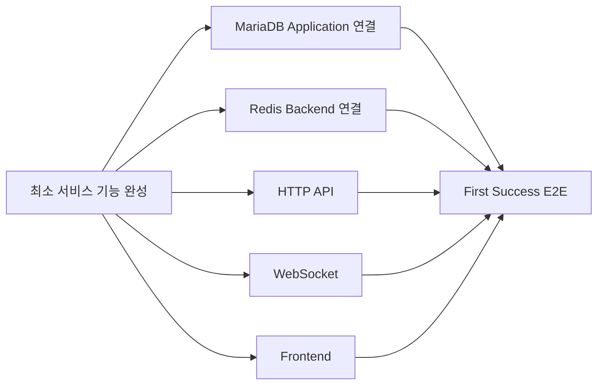
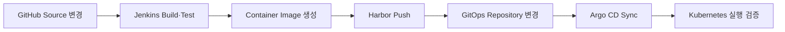
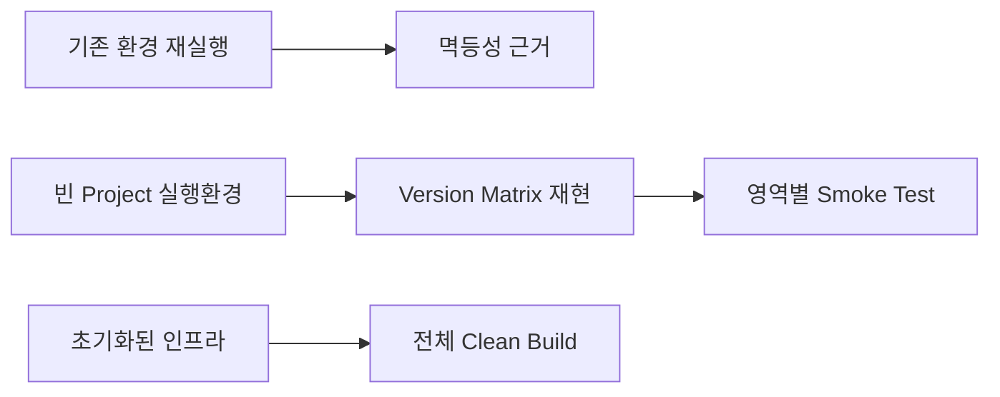

# 1차 멘토링 정리 및 2차 멘토링 반영 추적

- **1차 멘토링:** 2026-09-01
- **멘토:** 레드햇 김명환 멘토님
- **1차 상태 기록 기준일:** 2026-09-02
- **Baseline Audit Cutoff:** 2026-09-02 10:55 KST
- **2차 멘토링 예정:** 2026-09-15
- **대상:** 석판팀 「石나가는 판단」 1차 프로젝트
- **목적:** 팀 공유, 멘토 피드백 반영 추적, 1·2차 멘토링 사이의 변화 기록, 포트폴리오 근거 보존

> [!IMPORTANT]
> 이 문서는 단순 회의록이 아니라 **멘토링 내용과 2026-09-02 시점의 실제 프로젝트 상태를 함께 기록하는 기준 문서**다. 멘토 의견, 석판팀의 적용 판단, 실제 구현 상태를 구분해서 작성한다. GitHub에 코드나 Manifest가 존재한다는 이유만으로 구현 완료로 처리하지 않으며, Issue·Pull Request(PR)·Comment·실제 검증 결과를 연쇄 확인해 근거가 있는 내용만 현재 상태로 기록한다.

> [!NOTE]
> 멘토의 질문에 대한 `확인 답변`은 멘토링 당시 즉석 답변을 그대로 옮긴 것이 아니다. **2026-09-02 Baseline Audit Cutoff 기준 `seokpan` Organization에서 실제 근거를 확인할 수 있는 경우에만 작성**한다. 근거가 충분하지 않으면 답변 칸을 비운다.

> [!WARNING]
> 현재 문서는 확보된 녹음·전사 자료와 기존 멘토링 정리를 바탕으로 재구성했다. 자동 전사에서 제품명이나 전문 용어가 불명확한 부분은 특정 제품으로 임의 확정하지 않는다. 원본 전사 전체와의 최종 1:1 대조 전까지는 `발언 누락 0건`을 확정하지 않는다.

---

## Summary

레드햇 김명환 멘토님은 석판팀의 현재 기술 선택을 전면 수정해야 한다고 보지 않았다. Jenkins, Gateway API, Argo CD, Prometheus·Grafana·Loki·Alertmanager, Ansible 등 현재 방향은 유지할 수 있다는 취지였고, **새로운 기술을 계속 추가하기보다 현재 선택한 구조를 실제로 동작시키고 설명할 수 있는 수준까지 완성하는 것**을 중요하게 보았다.

특히 1차 프로젝트와 직접 연결되는 내용은 다음과 같다.

| 멘토링 내용의 성격 | 주요 내용 | 2026-09-02 상태 | 석판팀 적용 판단 |
| --- | --- | --- | --- |
| 핵심 권고 | 최소 서비스 기능을 실제 사용자 흐름으로 연결 | 진행 중 | 1차 프로젝트 우선 작업 |
| 핵심 권고 | Ansible 자동화가 실제로 재실행·재사용되는 근거 확보 | 부분 검증 | 기존 환경 재실행·실행환경 재현·Clean Build를 구분해 증명 |
| 구현 보완 권고 | 서비스 관점과 클러스터 관점 Dashboard 분리 | 확인 근거 부족 | 실제 Grafana 실행 환경에서 확인 |
| 구현 보완 권고 | Alertmanager를 외부 알림과 연결 | 확인 근거 부족 | E-mail 실제 수신을 우선 검증 |
| 구현 보완 권고 | 역할별 접근 권한 분리 | **현재 정의 범위 완료** | 현행 RBAC 유지, 추가 권한은 필요할 때 최소 범위로 확장 |
| 설계·문서화 권고 | HA·Backup/Restore·Cluster-level DR을 구분 | DB Backup/Restore는 실증, Cluster-level DR은 미구현 | 구현 범위와 한계를 명확히 기록 |
| 현업 관점 설명 | Container Image 취약점 검사 | 확인 근거 없음 | CI 완성도와 일정에 따라 적용 여부 결정 |
| 현업 관점 설명 | Kubernetes 보안·거버넌스·컴플라이언스 검사 | 확인 근거 없음 | 경량 검사 또는 미적용 사유 기록 검토 |
| 현업 관점 설명 | Tekton, LDAP/OIDC/SSO, Multi-cluster GitOps | 현재 필수 아님 | 1차를 복잡하게 만들지 않고 후속 확장 근거로 보존 |
| 긍정 평가·팀 운영 조언 | GitHub Repository·Issue·문서 중심의 기록을 유지하며 진행·문제·다음 작업을 자주 공유 | GitHub 중심으로 수행 중 | 현재 방식 유지·보완 |

### 1차 → 2차 멘토링 기록 방식


**2026-09-02 상태는 이후 작업으로 덮어쓰지 않는다.** 9월 15일에는 별도 상태 칸에 결과를 추가해 변화 자체가 남도록 한다.

---

## 목차

1. [멘토링 내용을 읽는 기준](#1-멘토링-내용을-읽는-기준)
2. [멘토링 주요 내용](#2-멘토링-주요-내용)
3. [멘토가 확인한 질문과 2026-09-02 기준 답변](#3-멘토가-확인한-질문과-2026-09-02-기준-답변)
4. [2026-09-02 프로젝트 Baseline](#4-2026-09-02-프로젝트-baseline)
5. [2차 멘토링 반영 추적](#5-2차-멘토링-반영-추적)
6. [피드백과 연결되는 실제 프로젝트 작업](#6-피드백과-연결되는-실제-프로젝트-작업)
7. [완료 여부 체크리스트](#7-완료-여부-체크리스트)
8. [팀 운영·문서화·포트폴리오 관련 조언](#8-팀-운영문서화포트폴리오-관련-조언)
9. [1차 → 2차 멘토링 변화 기록](#9-1차--2차-멘토링-변화-기록)
10. [GitHub 근거 색인](#10-github-근거-색인)

---

# 1. 멘토링 내용을 읽는 기준

## 1.1 분류 기준

| 유형 | 의미 |
| --- | --- |
| **핵심 권고** | 현재 1차 프로젝트의 성공과 결과 설명에 직접 영향을 주는 조언 |
| **구현 보완 권고** | 현재 구조를 유지하면서 운영·검증 수준을 높일 수 있는 내용 |
| **설계·문서화 권고** | 당장 구현하기보다 범위·한계·확장 방식을 명확히 남길 필요가 있는 내용 |
| **현업 관점 설명** | 실무에서 사용하는 방식, 대안 기술, 운영 구조를 설명한 내용 |
| **확장 아이디어** | 현재 MVP 필수 범위가 아니라 차기 단계나 추가 실험에서 고려할 내용 |
| **긍정 평가** | 현재 기술 선택 또는 진행 방향을 유지해도 된다는 취지의 평가 |
| **확인 질문** | 현재 구현 상태와 설계 의도를 파악하기 위해 멘토가 물어본 내용 |

> [!NOTE]
> 위 분류는 레드햇 김명환 멘토님이 직접 부여한 공식 등급이나 우선순위가 아니다. **멘토링 내용을 권고·현업 사례·확장 설명 등 성격별로 구분해 왜곡 없이 추적하기 위해 석판팀이 문서상 재구성한 분류**다.

> [!CAUTION]
> `Tekton이 언급됐다 → Jenkins를 교체해야 한다`, `LDAP/OIDC가 언급됐다 → 지금 SSO를 구축해야 한다`, `DR이 언급됐다 → 현재 장비로 Secondary Cluster를 반드시 만들어야 한다`처럼 확대 해석하지 않는다. **멘토가 설명한 현업 사례와 석판팀이 실제로 채택할 범위를 분리**한다.

## 1.2 이 문서에서 자주 쓰는 용어

| 용어 | 이 문서에서의 의미 |
| --- | --- |
| **Runtime / 실행 환경** | 실제 Kubernetes Cluster나 서버에서 구성요소가 실행되는 상태 |
| **Manifest** | Kubernetes Resource를 선언하는 YAML 파일 |
| **Pipeline** | Source 변경부터 Build·Test·Image 생성·배포로 이어지는 CI/CD 작업 흐름 |
| **Namespace** | Kubernetes 안에서 Resource와 권한 범위를 논리적으로 나누는 영역 |
| **ServiceAccount** | Kubernetes 내부에서 API 접근 권한을 부여할 때 사용하는 계정 |
| **StatefulSet** | 데이터·고정 식별자가 필요한 Pod를 관리하는 Kubernetes Workload Resource |
| **PVC (PersistentVolumeClaim)** | Pod가 사용할 영구 Storage를 요청하는 Kubernetes Resource |
| **Smoke Test** | 핵심 기능이 최소한 정상 동작하는지 빠르게 확인하는 기본 검증 |
| **Clean Build** | 기존 구축 결과를 재사용하지 않고 초기 상태에서 처음부터 다시 구축하는 검증 |
| **Evidence / 검증 근거** | 명령 결과, 로그, Metric, Screenshot, Issue/PR 기록 등 실제 수행·결과를 증명하는 자료 |
| **Baseline** | 이후 변화와 비교하기 위해 고정해 두는 기준 시점의 상태 |

---

# 2. 멘토링 주요 내용

## 2.1 최소 서비스 기능을 먼저 실제로 연결

### 멘토 의견

현재 프로젝트의 중심은 애플리케이션 자체의 상품성을 높이는 것이 아니라 **인프라 구축과 자동화**에 있다. 따라서 Frontend 디자인이나 세부 기능을 상용 서비스 수준으로 끌어올리는 데 지나치게 많은 시간을 사용할 필요는 없다.

다만 프로젝트 제목 자체가 실시간 참여형 오목 서비스이므로, **서비스라고 설명할 수 있는 최소 기능은 실제로 동작해야 한다.** 어느 수준까지 구현할지는 팀이 정할 문제지만, 서비스 기능이 없는 상태에서 인프라만 보여주는 것도 적절하지 않다는 취지였다.

추가 기능을 계속 늘리기보다 프로젝트 목적을 증명하는 최소 흐름을 먼저 완성하고, 그 다음 장애·복구·부하·운영 검증으로 넘어가는 선택과 집중이 필요하다고 조언했다.

### 석판팀에 적용할 점

현재 최소 흐름은 다음처럼 본다.

`사용자 진입 → 방 생성·입장 → 팀 선택·Ready → 투표 → 공식 착수 → 결과 처리·저장`

이 흐름이 실제 HTTP/WebSocket·MariaDB·Redis·Frontend와 연결된 뒤에야 `First Success E2E(End-to-End, 사용자의 처음부터 끝까지 실제 서비스 흐름 검증)`를 완료했다고 본다.

### 2026-09-02 상태

**진행 중**이다.

`seokpan-app`에서는 방 관리, 15×15 오목/렌주 규칙, 투표·턴, Pass, 승패·몰수·Rating 등 외부 DB나 Redis 없이 검증할 수 있는 핵심 게임 규칙과 자동 Test가 구현돼 있다. MariaDB 7개 Table Model과 Alembic Baseline도 코드화됐다.

9월 2일에는 후속 Schema/Migration 준비 작업도 진행되고 있으나, **실제 MariaDB·MaxScale Runtime에 접속하는 Persistence Adapter 통합은 아직 수행 완료 근거가 없다.**

Roadmap상 Redis Adapter, HTTP/WebSocket 기능 흐름, Headless E2E, Frontend First Success, Container/Jenkins, Provider/GitOps 통합도 아직 남아 있다.

따라서 **핵심 게임 규칙·DB Schema/Migration 준비와 실제 서비스 Runtime 연결 완료를 구분한다.**

---

## 2.2 Jenkins와 Tekton

### 멘토 의견

Jenkins는 Plugin 생태계가 크고 범용적으로 사용할 수 있는 강력한 CI/CD(Continuous Integration / Continuous Delivery, 지속적 통합·전달) 도구다. Kubernetes에서도 충분히 사용할 수 있다.

반면 Tekton은 Kubernetes 환경을 전제로 만든 Kubernetes-native CI/CD Framework로, Task를 Container 단위로 실행하고 Kubernetes Resource와 직접 연결하기 좋다는 특징을 설명했다.

레드햇 김명환 멘토님은 **현재 Jenkins 선택이 잘못된 것이 아니며 그대로 구현해도 문제없다**는 취지로 설명했다.

### 석판팀에 적용할 점

1차 프로젝트에서 Jenkins를 Tekton으로 교체하지 않는다. 현재 Jenkins 기반 CI를 실제 동작까지 먼저 연결하고, Tekton은 향후 Kubernetes-native 대안으로 비교할 수 있는 후보로 남긴다.

### 2026-09-02 상태

Jenkins 관련 Kubernetes Manifest와 BuildKit Agent 구성이 존재하지만, `Source 변경 → Jenkins Build/Test → Container Image 생성 → Harbor Push` 전체가 실제로 성공했다는 근거는 아직 확정하지 않는다.

---

## 2.3 CI/CD 흐름, Image Scan, 승인 절차

### 멘토 의견

GitHub의 Source 변경을 Jenkins가 받아 Build하고, Container Image를 Registry에 저장한 뒤 배포로 이어지는 기본 흐름은 일반적인 구조에 맞는다고 평가했다.

현업에서는 Source Code Test뿐 아니라 최종 Container Image에 알려진 취약점이 있는지 검사하는 단계를 추가하는 경우가 많다고 설명했다. 자동 전사에서 Scanner 제품명이 명확하지 않은 부분이 있으므로 **특정 제품을 멘토가 지정했다고 기록하지 않는다.**

또한 개발 환경은 자동 배포를 허용하더라도 Staging·Production처럼 영향이 큰 환경에서는 담당자나 관리자의 승인 절차를 두는 사례를 설명했다. 목적은 변경 통제, 책임, Audit(변경 이력과 승인 과정을 추적할 수 있는 상태)을 확보하는 데 있다.

### 석판팀에 적용할 점

- Jenkins → Harbor → GitOps → Argo CD의 기본 책임 분리는 유지한다.
- 전체 Pipeline의 실제 성공을 먼저 확보한다.
- Image Vulnerability Scan은 일정과 현재 CI 완성도를 보고 추가 여부를 결정한다.
- 실제 Dev/Staging/Production 환경이 없는 상태에서 Branch만 형식적으로 늘리지 않는다.
- GitHub `Issue → Branch → Commit → Pull Request → Review → Merge` 흐름을 현재 프로젝트의 변경 승인·추적 근거로 활용한다.

### 2026-09-02 상태

실제 Jenkins Build·Harbor Push·서비스 자동 배포 전체 성공 근거는 확인되지 않았다. 따라서 완료로 기록하지 않는다.

---

## 2.4 Gateway API 선택

### 멘토 의견

기존 Ingress 중심 방식보다 Gateway API 방향을 선택한 것을 긍정적으로 평가했다.

Gateway API는 Kubernetes 외부 트래픽 진입과 Routing을 여러 역할별 Resource로 나누어 관리하기 위한 표준 API이며, 석판팀은 NGINX Gateway Fabric을 구현체로 사용한다.

### 석판팀에 적용할 점

Gateway API + NGINX Gateway Fabric 방향을 유지한다. 기본 HTTP 진입 경로와 실제 HTTPS/WSS(WebSocket Secure, TLS를 사용하는 WebSocket) 서비스 진입 검증을 구분해 기록한다.

### 2026-09-02 상태

**HTTP 기본 진입 경로는 검증 완료**, HTTPS/WSS는 미완료다.

확인된 내용:

- `application/seokpan-gateway` 및 Data Plane 생성
- NGINX Gateway Fabric Pod Running
- HTTP NodePort `30080`
- HTTPS NodePort 구조 `30443`
- Gateway `Programmed=True`
- HTTP Listener 정상
- LB-01 → Worker `30080` TCP 통신 PASS

남은 내용:

- 서비스 TLS Secret 연결
- 실제 443 Listener 구성
- `30443` 실제 HTTPS 통신
- Frontend/API/WebSocket Route
- 실제 HTTPS/WSS End-to-End 검증

---

## 2.5 Argo CD와 GitOps

### 멘토 의견

Argo CD는 단일 애플리케이션 배포뿐 아니라 Git을 기준 상태로 사용하는 GitOps 방식으로 여러 Kubernetes Cluster와 정책을 관리하는 데 확장할 수 있다고 설명했다.

DR 상황에서 Argo CD 자체가 장애 난 Primary Cluster에만 존재하면 관리 기능도 함께 사라질 수 있으므로, 양쪽 Cluster 또는 별도 관리 영역에 관리 기능을 두는 방식도 현업에서 고려할 수 있다고 설명했다.

### 석판팀에 적용할 점

현재 단일 Cluster에서 Argo CD를 유지한다. 1차 프로젝트에서는 Multi-cluster 관리 기능을 추가하기보다 현재 GitOps 배포 구조를 제대로 완성하는 것이 우선이다.

### 2026-09-02 상태

Argo CD Child `Application` 선언 공식 경로는 `argocd/applications/`로 정리됐다. Storage와 Redis는 실제 GitOps 관리 대상에 포함돼 있으며 Redis는 `Synced / Healthy`와 실행 상태 검증까지 완료됐다.

서비스 Frontend/Backend와 Jenkins·Observability의 전체 GitOps 배포가 완료됐다고는 기록하지 않는다.

---

## 2.6 Observability: Dashboard를 넘어 외부 알림까지

### 멘토 의견

Prometheus, Grafana, Loki, Alertmanager 선택은 적절하다고 평가했다. Dashboard에 경고만 표시하는 것보다 실제 운영자·개발자가 **외부 알림 채널로 알림을 받도록 연결**하면 운영 기능을 높일 수 있다고 설명했다.

Loki에서 반복되거나 발생해서는 안 되는 Application Error를 찾아 담당자에게 전달하는 방식도 고려할 수 있다고 했다.

### 석판팀에 적용할 점

MVP에서 이미 계획한 Alertmanager E-mail 알림을 우선 실제 수신까지 검증한다. Discord는 석판팀의 선택사항으로 유지한다.

최소 검증 흐름은 다음과 같다.

`Alert 조건 발생 → Prometheus Alert 확인 → Alertmanager 수신 → E-mail 실제 수신 → 정상화 → Alert 해제`

발생·수신 시각도 함께 남긴다. Loki 기반 오류 Alert는 일정 여유가 있을 때 추가한다.

### 2026-09-02 상태

Observability Manifest와 설정 자산은 존재하지만, Prometheus·Grafana·Loki·Alertmanager 전체 실행 상태와 실제 E-mail 수신 성공을 확정할 근거는 아직 확인되지 않았다.

---

## 2.7 서비스 관점과 클러스터 관점 Dashboard 분리

### 멘토 의견

하나의 Grafana Dashboard에 모든 정보를 넣기보다 보는 사람과 목적에 맞게 Dashboard를 나누는 것이 좋다고 권고했다.

서비스 관점에서는 Application 실행 상태, Traffic, 요청·처리량, 오류 등을 볼 수 있고, 클러스터·인프라 관점에서는 Node·Pod 상태, CPU·Memory, Kubernetes Resource와 인프라 장애 상태 등을 볼 수 있다고 설명했다.

### 석판팀에 적용할 점

최소 두 관점으로 구분하는 방향을 검토한다.

- `Service Overview`
- `Kubernetes / Infrastructure Overview`

필요하면 CI/CD·DB·Storage를 별도 Dashboard 또는 Row로 확장한다.

### 2026-09-02 상태

Dashboard Provisioning 관련 자산은 있으나 두 관점의 실제 Grafana Dashboard가 실행 환경에서 정상 조회됐다는 근거는 확정하지 않는다.

---

## 2.8 역할별 접근 권한과 계정 관리

### 멘토 의견

Jenkins, Argo CD, Kubernetes, Grafana 등 여러 관리 도구를 사용하면 사용자별 계정과 권한을 관리해야 한다. 현업에서는 LDAP(Lightweight Directory Access Protocol), OIDC(OpenID Connect), SSO(Single Sign-On) 같은 Identity Provider를 연계하기도 하며, 핵심은 모든 사용자가 모든 것을 수정하는 구조가 아니라 역할에 따라 조회·변경 범위를 나누는 것이다.

개발 조직은 자기 서비스와 Pipeline, 운영 조직은 인프라와 운영 Dashboard, QA는 테스트 범위처럼 역할을 나누는 사례를 설명했다. 조회 권한과 변경 권한도 구분할 수 있다.

4명이 수행하는 교육 프로젝트에서 별도 LDAP/SSO 플랫폼을 반드시 구축하라고 요구한 것은 아니었다.

### 석판팀에 적용할 점

현재 Kubernetes RBAC(Role-Based Access Control, 역할 기반 접근 제어)를 우선 유지한다. 추가 권한은 실제 필요가 확인될 때 최소 범위로만 추가한다. LDAP/OIDC 기반 통합 인증은 후속 확장 대상으로 둔다.

### 2026-09-02 상태

**현재 정의한 Kubernetes RBAC Bootstrap 범위는 완료됐다.**

실제 검증된 내용:

- `application`, `platform`, `observability`, `cicd`, `storage-infra` Namespace
- 담당자별 ServiceAccount
- 정태훈: `application`, `platform` 관리자 권한
- 최유준: `cicd`, `observability` 관리자 권한
- 김상희·이유빈: Cluster 조회 권한
- 김상희: `storage-infra` Namespace의 Storage 작업 권한
- `kubectl auth can-i` 허용·거부 검증
- 정태훈 전용 kubeconfig로 `/etc/kubernetes/admin.conf` 없이 접근 검증
- Cluster-scoped StorageClass/PV 권한이 불필요하게 확대되지 않음을 확인

향후 Redis Recovery 또는 Argo CD 운영에서 추가 권한이 실제 필요해질 경우 그 시점에 최소 권한을 추가한다.

---

## 2.9 Cluster-level DR과 현재 복구 범위

### 멘토 의견

Kubernetes의 Replica나 Pod 재기동, DB Replication 같은 가용성 기능과 전체 Cluster가 사라졌을 때 서비스를 다른 환경에서 복구하는 DR(Disaster Recovery, 재해 복구)을 구분해야 한다고 설명했다.

Physical Server 장애가 여러 VM과 구성요소에 동시에 영향을 줄 수 있고, Backup 데이터가 존재해도 복구할 실행 환경이 없으면 Cluster-level DR이 완성된 것은 아니다.

현재 장비 수와 남은 기간을 고려하면 Secondary Cluster까지 실제 구현하는 것은 부담이 크므로, 결과물에는 다음을 명확히 남기는 방향을 권했다.

- DR을 고려했다는 사실
- 현재 구현한 복구 범위
- 구현하지 않은 범위
- 기간·장비 제약
- 추가 자원이 있다면 어떻게 확장할지
- 프로젝트 성공을 우선해 무엇을 후속으로 미뤘는지

### 석판팀에 적용할 점

다음 개념을 분리한다.

- Kubernetes Workload Replica·Restart → 서비스/구성요소 수준 가용성
- MariaDB Replication·Failover → DB 가용성
- MariaDB Backup/Restore → 데이터 복구
- Ansible 재구축 → 인프라 재생성 수단
- Secondary Cluster + 데이터·트래픽·관리 기능 전환 → Cluster-level DR

### 2026-09-02 상태

MariaDB Full Backup/Restore는 실제 검증 완료했다.

- Full Backup
- Prepare
- SHA-256 Checksum
- NFS Staging
- 격리 Restore
- 운영본과 복구본 표본 데이터 일치 확인
- **Restore RTO(Recovery Time Objective, 복구 목표 시간) 실측 3분 23초**
- RPO(Recovery Point Objective, 허용 가능한 데이터 손실 범위)는 정기 Backup 주기가 아직 고정되지 않아 `최대 Backup 주기만큼`으로 표현

반면 Secondary Cluster로 전체 서비스를 전환하는 Cluster-level DR은 구현하지 않았다.

---

## 2.10 Ansible 자동화의 증명과 재사용성

### 멘토 의견

인프라가 이미 구축돼 있다는 사실만으로는 Ansible 자동화로 구축했다는 것을 충분히 보여주기 어렵다. 다음과 같은 검증 근거가 필요하다고 조언했다.

- Playbook 실행 결과
- 실행 로그 또는 캡처
- 어떤 순서로 자동화가 실행되는지 보여주는 흐름
- 각 Playbook·Role이 무엇을 구성하는지 설명하는 자료
- 같은 환경에서 다시 실행했을 때 불필요한 변경이 발생하지 않는지 확인
- 새로운 환경에서도 재사용할 수 있는지 확인

실행 당시 기록이 부족하면 최소한 자동화 구조와 실행 흐름을 Diagram으로 설명할 수 있어야 한다는 의견도 있었다.

또한 전체 `A → Z`를 하나로만 실행하는 구조보다 특정 기능만 선택해 재실행할 수 있도록 모듈화하는 것이 좋다고 설명했다.

Ansible을 설치·구축에만 한정하지 않고 장애 이후 상태·Event·Log·Dump 수집, 담당자 통보 같은 운영 자동화에 활용하는 사례도 설명했다.

### 석판팀에 적용할 점

자동화 증명은 세 단계로 나눈다.

1. **기존 구축 환경 재실행** — 멱등성(Idempotency, 같은 작업을 다시 수행해도 불필요한 변경이 발생하지 않는 성질) 검증
2. **프로젝트 전용 Ansible 실행환경 재현** — 고정 Version Matrix와 주요 Smoke Test 검증
3. **완전히 초기화된 인프라 Clean Build** — 처음부터 전체 구축이 재현되는지 검증

또한 Role·독립 Playbook·통합 Playbook의 관계와 필요한 부분만 실행하는 방법을 설명할 수 있게 정리한다.

### 2026-09-02 상태

**① 기존 Kubernetes 구축 환경 재실행:** 검증됨.

- Control Plane 3대 / Worker 2대
- `changed=0`
- `failed=0`
- `unreachable=0`

**② 프로젝트 전용 Ansible 실행환경:** 상당 부분 검증됨.

- Project Python `3.12.13`
- ansible-core `2.20.8`
- kubernetes.core `6.5.0`
- Python kubernetes client `36.0.3`
- 빈 Project 환경에서 Version Matrix 재생성
- Kubernetes·Data/Storage 등 영역별 검증 수행

다만 전체 Smoke·Rollback의 최종 PASS 근거는 완전히 끝난 상태로 기록하지 않는다.

**③ 완전히 초기화된 Kubernetes 5개 Node Clean Build:** 미검증.

따라서 `Ansible 재현성 완료`라고 한 문장으로 표현하지 않는다.

---

## 2.11 Kubernetes 보안·거버넌스·컴플라이언스 검사

### 멘토 의견

Smoke Test 외에도 Kubernetes Cluster나 Manifest가 일반적인 보안·운영 기준을 충족하는지 검사하는 도구를 활용할 수 있다고 소개했다. 직접 모든 검사 로직을 만들기보다 Cloud Native 생태계와 Community의 기존 도구를 활용할 수 있다는 취지다.

### 석판팀에 적용할 점

시간이 허용된다면 도구 하나를 선정해 다음 정도만 검토한다.

- Baseline 검사
- 주요 Finding 분류
- 실제 수정 가능한 항목 조치
- 수정 전·후 비교
- 해결하지 않은 항목과 이유 기록

### 2026-09-02 상태

실제 적용했다고 확정할 GitHub 근거는 확인되지 않았다.

---

## 2.12 CNCF·Cloud Native 생태계 활용

### 멘토 의견

Kubernetes 환경에서는 CNCF(Cloud Native Computing Foundation)와 Cloud Native 생태계에 이미 존재하는 구성요소를 이해하고 활용하는 것이 중요하다고 설명했다. 같은 기능을 직접 다시 만드는 것보다 Kubernetes와 자연스럽게 연결되는 기존 도구를 적절히 활용하는 것이 효율적이라는 취지다.

### 석판팀에 적용할 점

새 기능이 필요할 때 다음 순서로 검토한다.

`문제 정의 → Kubernetes 기본 기능 → 공식/Cloud Native 생태계 도구 → 직접 구현 필요성`

기술을 많이 사용하는 것 자체를 목표로 하지 않는다.

---

## 2.13 AI 기반 운영 지원

### 멘토 의견

최근 Platform 제품과 운영 환경에서 AI Assistant/Agent를 YAML 작성, 문제 분석, 보안 Finding 정리, Cluster 운영 질의 등에 활용하는 사례를 설명했다.

### 석판팀에 적용할 점

현재 1차 프로젝트의 필수 실행 환경에 새로운 AI 분석 서비스를 추가한다는 의미로 해석하지 않는다. 프로젝트 핵심 구현을 방해하지 않는 범위에서 개발·운영 지원 도구로 활용할 수 있는 아이디어로 둔다.

---

# 3. 멘토가 확인한 질문과 2026-09-02 기준 답변

> [!NOTE]
> 아래 질문은 자동 전사와 멘토링의 문맥을 기준으로 **질문의 취지를 읽기 쉽게 재구성한 것**이며, 레드햇 김명환 멘토님의 발언을 문장 단위로 직접 인용한 것이 아니다. 답변 역시 멘토링 당시의 즉석 답변이 아니라 2026-09-02 Baseline Audit Cutoff 기준 GitHub 근거를 재확인해 작성한다.

| # | 레드햇 김명환 멘토님 확인 질문의 취지 | 2026-09-02 확인 답변 | 확인 수준 | 근거·주의사항 |
| --- | --- | --- | --- | --- |
| 1 | Git은 GitHub를 사용하는가? | `seokpan` GitHub Organization에서 공용 Repository를 운영하고 있다. | 확인됨 | `seokpan-app`, `seokpan-infra`, `seokpan-gitops`, `seokpan-docs` |
| 2 | Push·Commit Event가 CI/CD와 실제 연결되어 있는가? |  | 확인 근거 없음 | Webhook → Jenkins Pipeline 성공 근거 미확인 |
| 3 | Jenkins Build 결과 Image가 Harbor에 저장되는가? |  | 확인 근거 없음 | 실제 Build·Push 성공 근거 미확인 |
| 4 | Image 변경 후 자동 배포까지 연결되어 있는가? |  | 확인 근거 없음 | Jenkins → Harbor → GitOps → 실행 환경 전체 성공 근거 미확인 |
| 5 | Argo CD는 오목 서비스 배포에만 사용하는가? | 아니다. Storage와 Redis 같은 공통 실행 구성도 GitOps로 관리하고 있다. | 확인됨 | `argocd/applications/`, Storage·Redis 실행 검증 기록 |
| 6 | 모니터링 스택은 실제 배포되어 있는가? |  | 확인 근거 없음 | Manifest 존재와 전체 실행 완료를 구분 |
| 7 | Alertmanager가 외부 알림 채널로 실제 알림을 전송하는가? |  | 확인 근거 없음 | 실제 수신 근거 미확인. 석판팀은 E-mail을 MVP 우선 검증 대상으로 두고 Discord는 선택사항으로 관리 |
| 8 | Grafana Dashboard가 실제 구성되어 있는가? |  | 확인 근거 없음 | Provisioning 자산과 실제 조회 결과를 구분 |
| 9 | Jenkins·Argo CD·Kubernetes 등 계정·권한은 어떻게 관리하는가? | Kubernetes는 담당자별 ServiceAccount와 Namespace RBAC를 사용하고, 허용·거부 권한을 실제 검증했다. | 확인됨 | RBAC Bootstrap 완료 및 `kubectl auth can-i` 검증 |
| 10 | LDAP·OpenID Connect 등 통합 Identity Provider를 연계했는가? |  | 확인 근거 없음 | 실제 구현 근거 미확인 |
| 11 | Cluster-level DR을 구현했는가? | 전체 Cluster-level DR은 구현하지 않았다. MariaDB Backup/Restore와 일부 Failover 검증은 수행했다. | 확인됨 | DB Restore RTO 3분 23초, Secondary Cluster 미구현 |
| 12 | Kubernetes Version은 무엇인가? | Kubernetes `1.36.2`를 사용한다. | 확인됨 | 프로젝트 Version Matrix 기록 |
| 13 | Ansible은 어디까지 자동화했는가? | Network·Kubernetes·Calico·Gateway·MariaDB·MaxScale·NFS·Harbor 등 여러 영역이 Role/Playbook으로 코드화되어 있고 Kubernetes 기존 환경 재실행은 검증했다. | 일부 확인됨 | 영역별 Clean Build 검증 수준은 다름 |
| 14 | 새로운 환경에서 Ansible로 Cluster를 다시 만들 수 있는가? |  | 확인 근거 없음 | 완전히 초기화된 Kubernetes 5개 Node 전체 Clean Build는 미검증 |
| 15 | 자동화 실행·재현성을 어떤 근거로 남겼는가? | 기존 환경 재실행 결과, `changed=0 / failed=0 / unreachable=0`, Version Lock, 영역별 Test와 Issue/PR 기록을 남기고 있다. | 확인됨 | Clean Build 근거는 별도 미완료 |
| 16 | 보안·거버넌스·컴플라이언스 검사를 적용했는가? |  | 확인 근거 없음 | 실제 적용 근거 미확인 |
| 17 | 최소 서비스 기능은 어느 수준까지 구현됐는가? | 방 관리·오목 규칙·투표·턴·승패·Rating 등 핵심 게임 규칙과 Test는 구현됐지만 실제 사용자 전체 흐름은 아직 미완료다. | 확인됨 | `seokpan-app#3` Roadmap |
| 18 | Gateway API 기반 진입 경로는 실제 어디까지 되었는가? | 기본 HTTP 진입은 검증했고 HTTPS/WSS는 TLS Secret 및 서비스 연결이 남아 있다. | 확인됨 | `seokpan-gitops#5` 실행 검증 기록 |

> [!IMPORTANT]
> 빈 답변은 `구현하지 않았다`는 뜻이 아니라 **현재 문서에서 사실로 확정할 근거가 충분하지 않다는 뜻**이다.

---

# 4. 2026-09-02 프로젝트 Baseline

이 표는 2차 멘토링과 비교하기 위한 기준점이다. 이후 상태가 바뀌더라도 9월 2일 상태를 덮어쓰지 않는다.

## 4.1 Baseline Git Snapshot

9월 2일에도 각 Repository의 `main`과 Issue·PR·Comment는 계속 변경될 수 있으므로 날짜만으로 기준점을 남기지 않는다. 이 문서의 2026-09-02 Baseline은 **2026-09-02 10:55 KST를 Audit Cutoff**로 하며, 아래 `main` Commit과 그 시각까지 확인한 관련 Issue·PR·Comment·Runtime Evidence를 기준으로 고정한다.

| Repository | Baseline `main` Commit |
| --- | --- |
| `seokpan-app` | `89857758ec5abc949b58c7e3965682c878c67b7e` |
| `seokpan-infra` | `21c31e5a09ecea10d18ef5ce4445755bd83e31c8` |
| `seokpan-gitops` | `448748e5c70bf8c51ea414e8aa17858bcc9757c5` |
| `seokpan-docs` | `a5d60066aa5c68bb09e03c9b2f1bbe3490e37e79` |

> [!IMPORTANT]
> 9월 15일 비교 시 위 SHA와 Audit Cutoff를 변경하지 않는다. 이후 새 Commit·Issue·PR·Comment가 생기면 `2026-09-15 상태`와 변화 기록에 추가하며, 9월 2일 Baseline 자체는 과거 Snapshot으로 보존한다.

## 4.2 상태 Baseline

| 영역 | 2026-09-02 상태 | 당시 한계 |
| --- | --- | --- |
| 최소 서비스 First Success | 진행 중 | HTTP/WebSocket·Frontend·전체 E2E 미완료 |
| MariaDB Application 연결 | Schema/Migration 준비 진행 | 7개 Table Model·Alembic Baseline 및 후속 Migration 준비와 실제 Persistence Adapter·MariaDB/MaxScale Runtime 연결을 구분. Runtime Provider 통합은 미완료 |
| Redis 실행 환경 | 대부분 완료 | Argo CD Sync, StatefulSet, PVC, AOF, Write/Read, 재기동 후 데이터 유지 PASS |
| Backend → Redis | 대기 | 실제 Backend Pod가 없어 Service DNS 연결 검증 대기 |
| Jenkins CI | 확인 근거 없음 | 실제 Source 변경 → Build/Test 성공 근거 미확인 |
| Harbor Image Push | 확인 근거 없음 | Jenkins/Agent에서 실제 Push 성공 근거 미확인 |
| Argo CD | 부분 완료 | Storage·Redis 실제 관리, 서비스·Jenkins·Observability 전체 연결은 미확정 |
| Gateway HTTP | 완료 | LB → Worker NodePort `30080` 확인 |
| Gateway HTTPS/WSS | 미완료 | TLS Secret과 실제 Service Route 필요 |
| Kubernetes RBAC | 현재 정의 범위 완료 | 향후 실제 필요 시 추가 최소 권한 검토 |
| Kubernetes 기존 환경 Ansible 재실행 | 완료 | 기존 구축 환경 기준 |
| Project Ansible 실행환경 재현 | 부분 검증 | 전체 Smoke·Rollback 최종 PASS 정리 필요 |
| Kubernetes 전체 Clean Build | 미검증 | 초기화된 5개 Node 전체 재구축 미실시 |
| MariaDB Backup/Restore | 검증 완료 | Backup 자동 주기 미확정 |
| Cluster-level DR | 미구현 | Secondary Cluster·전환 구조 없음 |
| Observability 전체 실행 | 확인 근거 부족 | Manifest/설정 존재와 실제 실행 검증을 구분 |
| 외부 Alert | 확인 근거 없음 | 실제 E-mail 수신 미확인 |
| Image Vulnerability Scan | 확인 근거 없음 | 적용 여부 미확정 |
| Security/Compliance 검사 | 확인 근거 없음 | 적용 여부 미확정 |

---

# 5. 2차 멘토링 반영 추적

## 5.1 상태 정의

| 상태 | 의미 |
| --- | --- |
| `미착수` | 아직 작업을 시작하지 않음 |
| `진행 중` | 구현 또는 검증이 진행 중 |
| `부분 반영` | 일부가 적용됐지만 권고의 확인 목적 전체를 만족하지 않음 |
| `검증 대기` | 구현 자산은 있으나 실제 실행·E2E·근거 확인이 남음 |
| `완료` | 필요한 구현과 검증 근거를 확보 |
| `후속 계획` | 현재 1차 핵심 범위에서는 구현하지 않고 향후 확장으로 관리 |
| `현행 유지` | 현재 선택을 유지하며 교체 작업을 하지 않음 |

## 5.2 2026-09-15 비교표

| 멘토링 항목 | 성격 | 9/2 Baseline | 석판팀 적용 판단 | 2026-09-15 상태 | 실제 변화 | 검증 근거 |
| --- | --- | --- | --- | --- | --- | --- |
| 최소 서비스 기능을 실제로 연결 | 핵심 권고 | 진행 중 | 1차 우선 |  |  |  |
| Ansible 실행 결과·재현성 증명 | 핵심 권고 | 부분 검증 | 기존 환경 / 실행환경 / Clean Build를 분리해 증명 |  |  |  |
| 자동화 모듈화·부분 재실행 | 구현 보완 권고 | 일부 반영 | Role/Playbook 구조와 실제 부분 실행 근거 정리 |  |  |  |
| 서비스/클러스터 Dashboard 분리 | 구현 보완 권고 | 확인 근거 부족 | 실제 Grafana에서 확인 |  |  |  |
| 외부 Alert 연결 | 구현 보완 권고 | 확인 근거 부족 | E-mail 수신 우선 |  |  |  |
| 역할별 접근 권한 분리 | 구현 보완 권고 | 현재 정의 범위 완료 | 현행 유지 |  |  |  |
| Image Vulnerability Scan | 현업 관점 설명 | 확인 근거 없음 | CI 완성도·일정 보고 결정 |  |  |  |
| Security/Compliance 검사 | 현업 관점 설명 | 확인 근거 없음 | 경량 검사 또는 미적용 사유 기록 |  |  |  |
| Cluster-level DR 한계 명시 | 설계·문서화 권고 | DB 복구 실증 / Cluster DR 미구현 | 구현 범위와 확장 구조를 문서화 |  |  |  |
| Jenkins 유지 / Tekton 대안 이해 | 현업 관점 설명 | Jenkins 유지 | 교체하지 않음 |  |  |  |
| LDAP/OIDC/SSO | 현업 관점 설명 | 미구현 | 1차 필수 아님 |  |  |  |
| Multi-cluster GitOps | 확장 아이디어 | 미구현 | 후속 확장 |  |  |  |
| GitHub Repository·Issue·문서 중심 기록 | 긍정 평가 | GitHub 중심 수행 중 | 현행 유지·보완 |  |  |  |
| 진행상황·문제·다음 작업 공유 | 팀 운영 조언 | GitHub 중심 수행 중 | 유지 |  |  |  |
| 수정 가능한 Markdown 기록 | 팀 운영 조언 | 반영 중 | 지속 |  |  |  |
| 자신의 작업을 근거와 함께 설명 | 팀 운영 조언 | 반영 중 | Issue/PR/검증 결과와 발표 연결 |  |  |  |

---

# 6. 피드백과 연결되는 실제 프로젝트 작업

멘토 피드백과 팀의 일반 구현 Task를 혼동하지 않는다. 예를 들어 멘토가 `MariaDB Adapter를 구현하라`고 직접 요구한 것이 아니라, **최소 서비스 기능을 실제로 완성하라**는 권고를 실현하기 위해 여러 구현 작업이 연결된다.

## 6.1 최소 서비스 기능 완성



## 6.2 CI/CD 완성



일부 Manifest가 존재한다고 전체 Pipeline 완료로 기록하지 않는다.

## 6.3 자동화 재현성 증명



세 경로는 서로 다른 주장이다.

---

# 7. 완료 여부 체크리스트

체크박스는 **완료 여부 자체를 추정하는 표가 아니라, 이 문서에서 완료를 주장할 수 있는 Evidence 확보 여부를 추적하는 표**로 사용한다.

- `[x]` = 해당 항목의 완료를 뒷받침하는 Evidence를 확보했다.
- `[ ]` = 완료 Evidence를 아직 확보하지 못했다. **반드시 `미구현`을 뜻하지는 않는다.** 실제 미구현이 확인된 경우에는 본문의 상태표·근거에서 별도로 명시한다.

## 서비스·배포

- [ ] 실제 사용자 흐름 기준 First Success E2E가 통과했다.
- [ ] Jenkins가 실제 Source 변경을 받아 Build·Test를 수행했다.
- [ ] Jenkins가 생성한 Container Image를 Harbor에 실제 Push했다.
- [x] Argo CD를 통해 Storage와 Redis가 실제 Cluster에 반영되는 것을 검증했다.
- [ ] Jenkins Build부터 서비스 GitOps 배포까지 전체 CI/CD 흐름을 검증했다.
- [x] Gateway의 기본 HTTP 진입 경로를 검증했다.
- [ ] 외부 진입점에서 실제 HTTPS 서비스에 접근했다.
- [ ] Gateway를 경유한 실제 WebSocket/WSS 연결·재연결을 검증했다.

## Redis

- [x] Redis StatefulSet이 `Running/Ready` 상태임을 확인했다.
- [x] Redis PVC가 `Bound`이고 NFS에 실제 연결된 것을 확인했다.
- [x] AOF와 `appendfsync everysec` 설정을 확인했다.
- [x] Redis Write/Read를 검증했다.
- [x] Redis Pod 재기동 후 테스트 데이터 유지 여부를 검증했다.
- [ ] 실제 Backend Pod에서 `redis.platform.svc.cluster.local:6379` 연결을 검증했다.

## 자동화

- [x] Kubernetes 통합 Playbook을 기존 환경에 재실행해 `changed=0`, `failed=0`, `unreachable=0`을 확인했다.
- [x] 빈 Project 환경에서 고정 Version Matrix를 다시 생성했다.
- [ ] Project Ansible 실행환경의 전체 Smoke Test·Rollback 최종 PASS를 정리했다.
- [ ] 완전히 초기화된 Kubernetes 5개 Node에서 전체 Clean Build를 검증했다.
- [ ] 자동화 전체 실행 순서를 발표·포트폴리오에서 바로 설명할 수 있는 자료로 정리했다.

## 접근 제어·운영

- [x] 역할별 Kubernetes 접근 허용·거부를 `kubectl auth can-i`로 검증했다.
- [x] 정태훈 전용 kubeconfig로 `admin.conf` 없이 실제 접근을 검증했다.
- [x] Storage 담당 권한을 Namespace 범위로 부여하고 Cluster-scoped 권한이 확대되지 않음을 검증했다.
- [ ] Service 관점 Grafana Dashboard를 실제 실행 환경에서 확인했다.
- [ ] Cluster/Infrastructure 관점 Grafana Dashboard를 실제 실행 환경에서 확인했다.
- [ ] Alertmanager가 실제 E-mail을 발송했다.
- [ ] Loki에서 Application 또는 Infrastructure Log를 실제 조회했다.

## 보안·복구

- [ ] Container Image Vulnerability Scan 적용 여부를 결정하고, 적용 시 결과를 확보했다.
- [ ] Kubernetes Security/Compliance 검사 적용 여부를 결정하고 결과 또는 미적용 사유를 기록했다.
- [x] MariaDB Full Backup과 격리 Restore를 실제 검증했다.
- [x] MariaDB Restore RTO를 측정했다.
- [ ] MariaDB Backup 주기와 운영 절차를 정해 RPO를 운영 기준으로 구체화했다.
- [ ] Cluster-level DR의 미구현 범위와 향후 확장 구조를 최종 결과물에 명확히 기록했다.

---

# 8. 팀 운영·문서화·포트폴리오 관련 조언

## 8.1 현재 GitHub 기반 기록 방식과 진행 상황 공유

### 멘토 의견

현재처럼 Repository, Issue, 문서에 작업과 진행 상태를 남기는 방식은 **유지해도 좋은 방향이라는 취지로 긍정적으로 평가했다.** 그 위에서 서로 다른 경험과 기술 수준을 가진 사람들이 팀 프로젝트를 수행하는 만큼 현재 진행 상황, 막힌 문제, 다음 작업, 다른 담당자에게 영향을 주는 변경을 지속적으로 공유할 필요가 있다고 조언했다.

자기 담당 영역만 끝내는 것이 아니라 다른 팀원의 작업을 막는 문제가 있으면 함께 해결해야 한다는 취지다. 짧은 Review와 진행 공유를 자주 하는 방식도 도움이 될 수 있다고 설명했다.

### 석판팀에 적용할 점

현재 GitHub Repository·Issue·PR·문서 중심 기록 방식은 유지한다. 고정된 긴 회의를 추가하기보다 문제 발생 시 즉시 대면 협의하고 GitHub Issue/PR과 통합 시점에서 변경을 기록한다. 공통 Endpoint, Namespace, DB Schema, Version, Secret 경계처럼 다른 담당자에게 영향을 주는 변경은 특히 명확하게 남긴다.

---

## 8.2 수정 가능한 문서 원본을 남길 것

### 멘토 의견

HWP나 PDF가 공식 제출물로 필요할 수 있어도 프로젝트 종료 후 수정·재활용하기 어렵기 때문에 Markdown 같은 수정 가능한 형식을 Git에 함께 남기는 것이 좋다고 조언했다. AI를 이용한 문서 형식 변환도 활용할 수 있다고 설명했다.

### 석판팀에 적용할 점

- PDF/HWP: 공식 제출·열람용
- Markdown: 구현 이후 변경·멘토링·결정·트러블슈팅·포트폴리오 재구성용
- Git: 변경 이력과 근거 연결용

---

## 8.3 자신이 한 일을 정확히 설명하는 연습

### 멘토 의견

많은 일을 해도 설명하지 못하면 외부에서는 수행 여부를 알 수 없다. 과장할 필요는 없지만 무엇을 했고, 왜 했고, 어떤 문제가 있었고, 결과가 어떻게 달라졌는지 설명할 수 있어야 한다고 조언했다.

작은 진행 공유와 Review 자체가 프로젝트 관리뿐 아니라 면접이나 조직 생활에서 자신의 작업을 설명하는 연습이 될 수 있다는 취지였다.

### 석판팀에 적용할 점

Issue·PR·실험 기록에는 최소한 다음을 남긴다.

- 왜 작업했는가
- 무엇을 변경했는가
- 어떻게 검증했는가
- 실제 결과는 무엇인가
- 아직 안 된 것은 무엇인가
- 다른 담당자에게 어떤 영향이 있는가

이 기록은 최종 발표와 포트폴리오에서 그대로 재사용할 수 있어야 한다.

---

## 8.4 멘토링 기록 공유 허용

1차 멘토링 후반에 석판팀이 멘토링 내용을 정리해 `seokpan-docs` 같은 팀 문서 공간에 보관하고, 이후 변화 비교 자료로 사용하는 것에 대해 질문했고 **레드햇 김명환 멘토님은 해당 정리·공유에 문제가 없다는 취지로 답했다.**

따라서 본 문서는 멘토 발언을 과장하거나 맥락을 바꾸지 않고, 프로젝트 개선과 후속 멘토링 비교를 위한 팀 공유·포트폴리오 근거로 관리한다.

---

# 9. 1차 → 2차 멘토링 변화 기록

2차 멘토링 전에는 단순히 `완료했다`고 체크하기보다 **왜 달라졌는지**를 남긴다.

| 멘토링 항목 | 9/2 당시 상태 | 팀의 판단 | 9/2~9/15 수행한 변경 | 검증 결과 | 9/15 남은 한계 |
| --- | --- | --- | --- | --- | --- |
| 최소 서비스 기능 완성 | 진행 중 |  |  |  |  |
| Ansible 자동화 증명 | 부분 검증 |  |  |  |  |
| 외부 Alert 연계 | 근거 부족 |  |  |  |  |
| Dashboard 분리 | 근거 부족 |  |  |  |  |
| 역할별 접근 제어 | 정의 범위 완료 |  |  |  |  |
| Image Scan | 근거 없음 |  |  |  |  |
| Security/Compliance | 근거 없음 |  |  |  |  |
| DR 범위 명확화 | DB 복구 실증 / Cluster DR 미구현 |  |  |  |  |
| GitHub 기록 방식 | 수행 중 |  |  |  |  |
| Markdown 기록 | 진행 중 |  |  |  |  |
| 팀 진행 공유·설명 | 진행 중 |  |  |  |  |

## 포트폴리오 전환 형식

최종 포트폴리오에서는 다음 구조로 재사용한다.

```text
1차 멘토링에서 확인된 문제·조언
→ 당시 실제 상태
→ 팀이 채택한 판단과 채택하지 않은 판단
→ 수행한 기술적 변경
→ Before / After 검증
→ 정량적 결과
→ 남은 제약과 후속 확장
```

멘토의 조언을 그대로 구현했다는 사실보다 **조언을 근거로 팀이 어떤 판단을 내렸고 무엇을 검증했는지**가 더 중요하다.

---

# 10. GitHub 근거 색인

아래는 본문에 사용한 주요 상태를 검증할 때 우선 확인할 경로다. 문서 본문은 이 링크를 열지 않아도 이해할 수 있도록 작성한다.

| 주장·상태 | Repository | 주요 Issue/PR | 확인 내용 |
| --- | --- | --- | --- |
| Application First Success 진행 상태 | `seokpan-app` | Issue #3 | A-01~A-10 Roadmap, First Success 미완료 상태 |
| 핵심 게임 규칙 구현 | `seokpan-app` | Issues/PRs #8~#16 | Room·Board/Renju·Vote/Turn·Result/Rating Domain 및 Test |
| MariaDB Model/Alembic | `seokpan-app` | Issue #17, PR #18, Issue #19, PR #20 | 7개 Table Model·Alembic Baseline 및 후속 Expand/Audit 준비. 실제 MariaDB/MaxScale Runtime Provider 통합과 구분 |
| Kubernetes RBAC | `seokpan-gitops` | Issue #3, PR #4, PR #8 | Namespace·ServiceAccount·RoleBinding·실제 `can-i` 검증 |
| Redis 실행 환경 | `seokpan-gitops` | Issue #7, PR #18 | Synced/Healthy, StatefulSet, PVC, AOF, 재기동 데이터 유지 |
| Gateway 기본 진입 | `seokpan-gitops` | Issue #5 | HTTP `30080` PASS, HTTPS/WSS 후속 상태 |
| Argo CD Root 경로 | `seokpan-gitops` | Issue #15 및 관련 PR | 공식 Child Application 경로 `argocd/applications/` |
| Ansible Version Lock | `seokpan-infra` | Issues #38, #41, #84 / PR #46 | Project 실행환경 Version Matrix와 재현성 검증 |
| Kubernetes 자동화 재실행 | `seokpan-infra` | Issue #7, PR #67 및 Issue #7 재실행 검증 Comment | 기존 환경 통합 Playbook Actual Run, `changed=0 / failed=0 / unreachable=0`, CP3+Worker2 Ready, Clean Build 미검증 한계 |
| MariaDB Backup/Restore | `seokpan-infra` | Issue #45 | Full Backup·격리 Restore·RTO 3분 23초 |
| Jenkins/BuildKit 잔여 항목 | `seokpan-infra`, `seokpan-gitops` | Infra #79, GitOps PR #19 등 | Harbor CA 신뢰·BuildKit Resource·실제 Pipeline 검증 대기 |
| Observability 상태 | `seokpan-gitops` | 관련 Manifest/PR #9, #11, #12 등 | 정적 Manifest·dry-run과 실제 실행 완료를 구분 |
| 프로젝트 결정 변경 | `seokpan-docs` | `PROJECT_CHANGES.md` 및 관련 Issue/PR | PDF 이후 확정 변경 이력 |

---

## 2차 멘토링 직전 갱신 원칙

2026-09-15 직전에는 다음 순서로 갱신한다.

1. `seokpan` Organization의 관련 Issue·PR·Comment·Commit·현재 `main`을 다시 확인한다.
2. 9월 2일 Baseline, Baseline Git Snapshot SHA, Audit Cutoff는 수정하지 않는다.
3. 9월 15일 상태와 검증 근거만 추가한다.
4. 실제로 변경된 항목은 `왜 바뀌었는지`까지 기록한다.
5. 멘토링 피드백 때문에 바뀐 것과 원래 계획된 작업을 구분한다.
6. 구현하지 못한 항목은 지우지 않고 미구현 사유와 후속 계획을 남긴다.
7. 2차 멘토링에서 새 피드백을 받으면 동일한 구조로 다음 변화 기록에 연결한다.