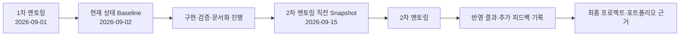

# Mentoring

석판팀 「石나가는 판단」 1차 프로젝트의 멘토링 내용을 **팀 공유, 후속 반영 확인, 프로젝트 변화 기록, 포트폴리오 근거**로 활용하기 위한 문서 영역입니다.

> [!IMPORTANT]
> 멘토링 기록은 단순 회의록이 아닙니다. 멘토 의견을 그대로 적는 데서 끝내지 않고, 해당 시점의 실제 프로젝트 상태와 이후 반영 결과를 함께 남깁니다.

## 회차별 기록

| 회차 | 일자 | 멘토 | 문서 | 상태 |
| --- | --- | --- | --- | --- |
| 1차 | 2026-09-01 | 레드햇 김명환 멘토님 | [1차 멘토링 정리 및 2차 멘토링 반영 추적](MENTORING-01_2026-09-01.md) | 기록 완료 / 반영 추적 중 |
| 2차 | 2026-09-15 예정 | 레드햇 김명환 멘토님 | 2차 멘토링 이후 추가 | 예정 |

## 기록 원칙

1. **멘토의 발언과 석판팀의 판단을 구분합니다.**
   - 멘토가 직접 권고한 내용
   - 현업 사례나 대안으로 소개한 내용
   - 현재 방향을 긍정적으로 평가한 내용
   - 석판팀이 실제 프로젝트에 적용하기로 한 내용
   - 아직 검토하지 않았거나 1차 범위에서 제외한 내용을 섞지 않습니다.

2. **실제 구현 상태는 GitHub 근거로 확인합니다.**
   - `seokpan-app`, `seokpan-infra`, `seokpan-gitops`, `seokpan-docs`의 Issue, Pull Request, Review/Comment, Commit, 현재 `main`의 코드·Manifest를 함께 확인합니다.
   - 계획이나 Manifest 존재만으로 Runtime 검증 완료라고 기록하지 않습니다.
   - 확인 가능한 근거가 없으면 추정해서 채우지 않습니다.

3. **회차 사이의 변화를 기록합니다.**
   - 1차 멘토링 직후의 상태를 Baseline으로 남깁니다.
   - 다음 멘토링에서는 같은 항목을 다시 확인해 `무엇이 바뀌었는지`, `왜 바뀌었는지`, `어떻게 검증했는지`를 기록합니다.

4. **포트폴리오에서 재사용할 수 있는 형태로 남깁니다.**
   - `피드백 → 판단 → 구현/조치 → 검증 → 결과`가 연결되도록 기록합니다.
   - 구현하지 않은 내용을 성과처럼 표현하지 않습니다.

## 회차 간 변화 기록 방식

체크박스는 `했다 / 안 했다`로 명확히 판단할 수 있는 작업에만 사용합니다. 진행 중이거나 일부만 반영된 항목은 `미착수 / 진행 중 / 부분 반영 / 검증 대기 / 완료 / 후속 계획` 상태를 사용해 실제 진행 정도를 보존합니다.
