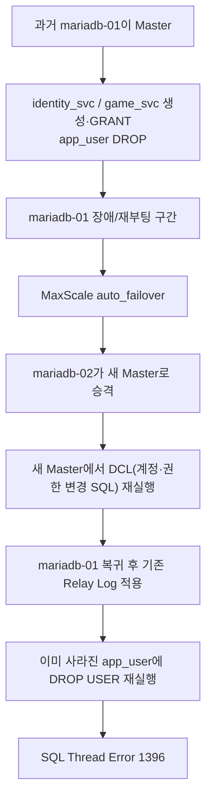

[← 트러블슈팅 목차로 돌아가기](README.md)

# TS-004 — MariaDB Backup 검증 중 실제 Master 역전과 DCL(계정·권한 변경 SQL) 복제 충돌로 SQL Thread 정지

> 이 문서는 「石나가는 판단」 프로젝트에서 실제로 발생하거나 검증 과정에서 발견된 문제를 기록한 개별 트러블슈팅 보고서입니다. 링크를 열지 않아도 사건의 배경, 영향, 원인, 조치, 검증 결과와 남은 사항을 이해할 수 있도록 작성합니다.

| 항목 | 내용 |
|---|---|
| **발생/발견 시기** | 2026-08-28 |
| **상태** | **해결 · 이후 설계 변경에 직접 영향** |
| **주 담당** | **김상희 — 데이터베이스·스토리지·복구** |
| **영향 범위** | 정태훈(애플리케이션의 DB 사용 경로), 이유빈(Inventory), DB를 사용하는 전체 구성요소 |

## 문제 개요

원래 목적은 `backup_svc` 계정을 만들고 MariaDB Backup/Restore를 검증하는 것이었다.

그런데 Replica 반영 여부를 확인하는 과정에서 `mariadb-01`의 SQL Thread가 멈춰 있는 것이 발견됐다.

핵심 오류:

```text
Last_SQL_Errno: 1396
Last_SQL_Error: Error 'Operation DROP USER failed for 'app_user'@'%'' on query
```

## 연쇄 분석



## 원인 분석

핵심은 Host 이름과 DB 역할을 동일시한 것이다.

초기에는:

```text
mariadb-01 = Master
mariadb-02 = Replica
```

처럼 생각했지만, 자동 장애조치(Auto Failover)가 존재하면 실제 실행 환경(Runtime)에서 이 역할은 바뀔 수 있다.

```text
Host identity ≠ Current DB role
```

즉 서버 이름은 고정이지만 Master/Slave는 현재 실행 상태다.

## 데이터 유실 여부 확인

먼저 데이터 손실 여부부터 확인했다.

`stone_game`의 7개 테이블을 양쪽에서 비교했다.

```text
member
member_stats
game
game_participant
move
game_result
rating_history
```

결과:

- 양쪽 동일
- 데이터 유실 없음

## 즉시 복구

Replication은 `DROP USER` 한 건에서 멈춰 있었다.

현재 이미 원하는 계정 상태가 만들어진 것을 확인한 뒤:

```sql
STOP SLAVE;
SET GLOBAL sql_slave_skip_counter = 1;
START SLAVE;
```

로 해당 이벤트만 Skip했다.

검증:

```text
Slave_IO_Running: Yes
Slave_SQL_Running: Yes
Seconds_Behind_Master: 0
```

## 여기서 만들어진 운영 원칙

1. Master 판별은 Host 이름이 아니라:

```bash
maxctrl list servers
```

로 한다.

2. 계정/권한 DCL은 **현재 Master에서 1회만 실행**한다.

3. Replica에서 DCL을 다시 실행하지 않는다.

4. Replication 오류 해결 전:

```text
에러 확인 → 데이터 무결성 확인 → 안전한 경우에만 Skip
```

순서를 지킨다.

## 당시 판단과 이후 수정

당시 트러블슈팅 중에는 두 서버가 서로 다른 GTID Domain을 가진 상태를 제한적으로 허용할 수 있다는 판단이 있었다.

그러나 이후 2026-09-01 Auto Failover/Auto Rejoin 구조를 실제로 코드화하면서 **이 토폴로지에서는 두 서버가 동일한 GTID Domain을 사용해야 한다**고 판단이 수정됐다.

자세한 후속 문제는 TS-017에서 연결된다.

## DR 검증으로 이어진 결과

이 오류 복구 뒤 다시:

- `backup_svc` 생성
- Replica 반영 확인
- `mariadb-backup` 성공
- XtraBackup Checkpoints 확인
- Test DB 생성
- Prepare
- Restore
- 데이터 정합성 확인

까지 완료됐다.

즉 원래 하려던 Backup/Restore 검증을 트러블슈팅 이후 다시 정상 완료했다.

## Before → After

```text
Before
Host 이름으로 Master를 가정
        ↓
DCL 재실행
        ↓
Replication 충돌

After
MaxScale로 실제 역할 확인
        ↓
현재 Master에서만 DCL
        ↓
Replica는 복제 결과만 검증
```

## 관련 근거

- Backup/Restore Issue #37: https://github.com/seokpan/seokpan-infra/issues/37
- 자동화 전환 Issue #54: https://github.com/seokpan/seokpan-infra/issues/54
- 자동화 PR #59: https://github.com/seokpan/seokpan-infra/pull/59
