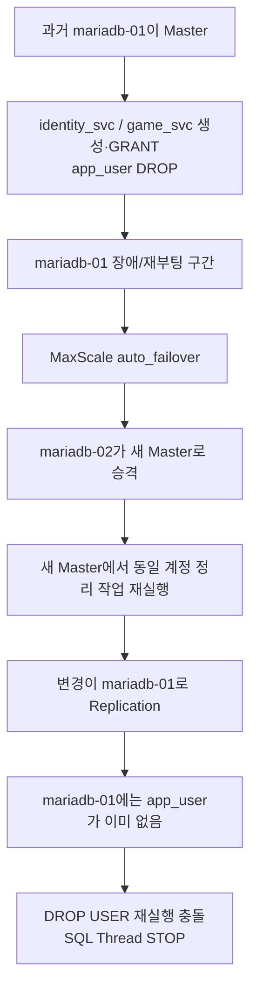

[← 트러블슈팅 목차로 돌아가기](README.md)

# TS-004 — MariaDB Backup 검증 중 실제 Master 역전과 DCL(계정·권한 변경 SQL) 복제 충돌로 SQL Thread 정지

> 이 문서는 「石나가는 판단」 프로젝트에서 실제로 발생하거나 검증 과정에서 발견된 문제를 기록한 개별 트러블슈팅 보고서입니다. 링크를 열지 않아도 사건의 배경, 영향, 원인, 조치, 검증 결과와 남은 사항을 이해할 수 있도록 작성합니다.

| 항목 | 내용 |
|---|---|
| **발생/발견 시기** | 2026-08-28 |
| **상태** | **해결 · 이후 설계 변경에 직접 영향** |
| **주 담당** | **김상희 — 데이터베이스·스토리지·복구** |
| **영향 범위** | 정태훈(애플리케이션의 DB 사용 경로), 이유빈(Inventory), DB를 사용하는 전체 구성요소 |

## 문제 개요

원래 목적은 `backup_svc` 계정을 만들고 MariaDB Backup/Restore를 검증하는 것이었다.

그런데 Replica 반영 여부를 확인하는 과정에서 `mariadb-01`의 SQL Thread가 멈춰 있는 것이 발견됐다.

핵심 오류:

```text
Last_SQL_Errno: 1396
Last_SQL_Error: Error 'Operation DROP USER failed for 'app_user'@'%'' on query
```

## 연쇄 분석



## 원인 분석

1. 문서상/초기 Inventory에서 `mariadb-01`을 Primary라고 고정해 생각하고 있었으나, 실제 실행 환경(Runtime)은 MaxScale Auto Failover 때문에 `mariadb-02`가 Master로 승격돼 있었다.
2. Failover 전·후 양쪽 Master에서 동일한 계정 DCL 작업이 독립적으로 수행됐다.
3. 계정 관련 DCL은 데이터 DML과 다르게 멱등적으로 흡수되지 않았다.
4. `slave_ddl_exec_mode=IDEMPOTENT`가 `CREATE/DROP USER`, `GRANT` 등 DCL까지 해결해주지는 않았다.

## 데이터 유실 여부 확인

- 실제 신규 Master의 `identity_svc`, `game_svc` 계정과 GRANT 정상
- 서비스 스키마 데이터의 실질적 유실 없음
- 문제는 복제 SQL Thread가 DCL 한 건에서 정지한 것이었다.

## 즉시 복구

```sql
STOP SLAVE SQL_THREAD;
SET GLOBAL sql_slave_skip_counter = 1;
START SLAVE SQL_THREAD;
```

당시 현재 Master 계열의 GTID가 양쪽에서 일치함을 확인했다.

## 여기서 만들어진 운영 원칙

**DB에 쓰기 작업을 하기 전에 문서나 호스트 이름으로 Master를 추정하지 않고 `maxctrl list servers`로 실제 실행 환경 Master를 확인한다.**

이 원칙은 이후:

- Inventory 구조 변경(TS-010)
- Version Upgrade 검증(TS-009)
- `read_only`/GTID 정리(TS-017)

로 이어졌다.

## 당시 판단과 이후 수정

당시 기록에는 과거 GTID Domain Divergence 일부를 “해당 노드가 재승격되지 않는 한 문제되지 않는다”고 판단한 부분이 있다.

그러나 이후 TS-017에서 **Auto Failover 구조상 어느 노드든 다시 승격될 수 있기 때문에 GTID Domain을 서버별로 다르게 고정하면 안 된다**는 점이 재검토되어 최종 코드가 수정됐다.

따라서 이 문서는 당시 판단을 그대로 최종 정답으로 취급하지 않고 **의사결정이 발전한 과정**으로 연결한다.

## DR 검증으로 이어진 결과

동일 일자 DR-01 검증에서는:

- 실제 Master: `mariadb-02`
- Full Backup → Prepare → SHA-256 → NFS Staging
- 격리 데이터 디렉터리 + 3307 포트 Restore
- `member 2`, `game 2`, `move 9` Count 일치
- **RTO: 3분 23초**
- 테스트 시점 데이터 손실: 0건
- 정기 Backup Schedule 미구현 상태이므로 RPO는 **최대 Backup 주기만큼**으로 정의

했다.

## Before → After

```text
Before
"mariadb-01이 Primary"라는 정적 전제
        ↓
Failover 이후에도 같은 전제로 DCL 수행
        ↓
중복 DCL이 Replica에서 충돌
        ↓
SQL Thread 정지

After
maxctrl로 실제 Master 확인
        ↓
실제 실행 역할 기준 작업
        ↓
Replication 상태 확인을 작업 완료조건에 포함
        ↓
Backup/Restore + RTO/RPO 실측
```

## 관련 근거

- Backup Issue #43: https://github.com/seokpan/seokpan-infra/issues/43
- DR-01 Issue #45: https://github.com/seokpan/seokpan-infra/issues/45