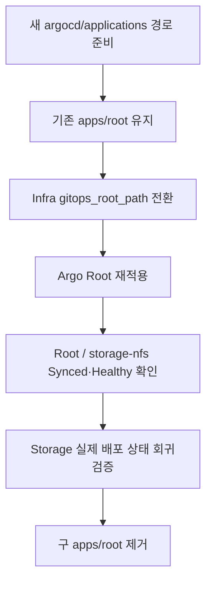

[← 트러블슈팅 목차로 돌아가기](README.md)

# TS-016 — GitOps Root Application 경로 전환 중 Argo CD 초기 구성 자동화(Bootstrap) 오류가 연쇄적으로 발생

> 이 문서는 「石나가는 판단」 프로젝트에서 실제로 발생하거나 검증 과정에서 발견된 문제를 기록한 개별 트러블슈팅 보고서입니다. 링크를 열지 않아도 사건의 배경, 영향, 원인, 조치, 검증 결과와 남은 사항을 이해할 수 있도록 작성합니다.

| 항목 | 내용 |
|---|---|
| **발생/발견 시기** | 2026-09-01 |
| **상태** | **해결** |
| **주 담당** | **정태훈(Kubernetes 플랫폼·GitOps 연동) + 최유준(Argo CD Bootstrap)** |
| **영향 범위** | 김상희(스토리지), Redis 및 애플리케이션 배포 환경 |

## 1단계. Root 경로의 의미가 잘못 섞임

초기 Argo 검증용 구조에서 `apps/root`가 만들어졌다.

그러나 GitHub 저장소(Repository) 역할을 다시 정리하면서:

- `apps/` → Frontend/Backend 애플리케이션의 실제 배포 Manifest
- `platform/` → Redis/Storage/Gateway 등 Kubernetes 플랫폼
- Argo CD 하위 Application(Child `Application`) 선언 → `argocd/applications/`

으로 분리하는 것이 더 적절하다고 확정했다.

## 안전한 전환 순서

기존 Root가 `prune/selfHeal`을 사용하므로 옛 경로를 먼저 삭제하면 배포 중인 하위 Application 삭제로 이어질 수 있었다.

따라서:



순서를 적용했다.

## 전환 중 실제로 폐기한 잘못된 연결: Redis PR #14

이 구조 문제는 단순 문서 검토가 아니라 실제 작업 재구성을 발생시켰다. Redis 실제 배포 Manifest 자체는 `platform/redis/`에서 정상적으로 준비되고 있었지만, 초기 PR #14는 하위 Application(Child Application) 선언을 기존 `apps/root/redis.yaml`에 추가했다.

재검토 결과 `apps/root`는 최초에는 Argo CD **검증용 경로**로 도입된 것이고, 그 경로를 정식 Application 선언 계층으로 승격한다는 명시적 결정 없이 Storage 배포 구성과 Redis가 계속 소비하려는 상태였다. 그래서 다음처럼 처리했다.

```text
Redis PR #14 생성
→ apps/root/redis.yaml 사용
→ Root 경로 의미 재검토
→ 테스트용 경로를 정식 계층처럼 쓰는 정합성 문제 확인
→ PR #14 Close / 미병합
→ Redis 실제 배포 Manifest 자체(platform/redis)는 보존
→ Root 구조 전환을 먼저 완료
→ argocd/applications/ 공식화
→ Redis PR #18을 최신 main 브랜치에서 다시 구성
→ Redis Application `Synced / Healthy` + PVC/AOF Persistence 검증 PASS
```

즉 이 사례의 안전조치는 "옛 경로를 지우지 않았다"에 그치지 않고, **잘못된 제어계층에 연결될 신규 Redis 배포 PR을 실제 Merge 전에 폐기하고 구조 결정을 선행**한 것이다.

## 2단계. 실제 Bootstrap 실행에서 kubeconfig `~` 경로 실패

Root 경로를 바꾸어 실제 `argocd_bootstrap`을 실행하는 과정에서:

```text
Could not find or access '~/.kube/seokpan-admin.conf'
on the Ansible Controller.
```

오류가 발생했다.

## 원인 분석

`kubernetes.core.k8s`에 전달된:

```text
~/.kube/seokpan-admin.conf
```

문자열은 Shell이 아니므로 `~`를 자동으로 HOME으로 확장하지 않았다.

## 1차 수정

```yaml
{{ lookup('env', 'HOME') }}/.kube/seokpan-admin.conf
```

형태로 실제 실행 사용자의 HOME을 명시적으로 해석하도록 수정했다.

## 3단계. 다음 실행에서 `/tmp` Sticky-bit 충돌 발생

kubeconfig 문제를 해결하고 다시 실행하자 이번에는:

```text
failed final rename ... Operation not permitted
```

이 발생했다.

## 원인 분석

Role이 Root Application Manifest를:

```text
/tmp/root-application-argocd.yaml
```

고정 파일명으로 사용하고 있었다.

이전 실행에서 root 소유 파일이 남아 있으면 `/tmp`의 sticky-bit 정책 때문에 `jth` 계정의 Ansible Template 모듈이 임시 파일을 최종 경로로 교체하는 과정에서 기존 파일을 덮어쓸 수 없었다.

## 2차 수정

- `ansible.builtin.tempfile`로 실행별 고유 임시 파일 생성
- Template을 그 경로로 Render
- `kubernetes.core.k8s`가 같은 임시 파일 사용
- 적용 후 삭제

## 최종 검증

전환 완료 후:

- Root Application `Synced / Healthy`
- Root Application 참조 경로 = `argocd/applications`
- `storage-nfs` `Synced / Healthy`
- NFS Provisioner `1/1 Running`
- 동일 `argocd_bootstrap` 재실행 RC=0
- 구 `apps/root` 제거 후에도 Storage 배포 상태 유지

Storage 담당 후속 회귀검증에서도:

- StorageClass `nfs-k8s` 유지
- RBAC 정상
- Redis PVC 이미 `Bound`
- 새 5Gi RWX 검증용(Validation) PVC `Bound`
- Pod에서 실제 `/mnt/validation.txt` Write 성공
- 검증 리소스 정리

까지 PASS했다.

## 이 사례의 핵심

단순히 “Argo 경로를 바꿨다”가 아니다.

```text
GitHub 저장소의 디렉토리 역할 정리
→ 안전한 전환 순서 설계
→ 실제 적용
→ kubeconfig의 `~` 경로가 자동으로 확장되지 않는 문제
→ 수정
→ 다시 적용
→ /tmp 파일 소유권 오류
→ 수정
→ Argo/Storage 실제 배포 상태 회귀검증
→ 옛 경로 제거
```

까지가 하나의 연쇄 트러블슈팅이다.

## 관련 근거

- GitOps 구조 결정 Issue #15: https://github.com/seokpan/seokpan-gitops/issues/15
- Docs PR #16: https://github.com/seokpan/seokpan-docs/pull/16
- GitOps 경로 준비 PR #16: https://github.com/seokpan/seokpan-gitops/pull/16
- 초기 Redis 연결 PR #14(Closed/미병합): https://github.com/seokpan/seokpan-gitops/pull/14
- Root 전환 후 Redis 재구성 PR #18: https://github.com/seokpan/seokpan-gitops/pull/18
- Infra Root Path PR #81: https://github.com/seokpan/seokpan-infra/pull/81
- kubeconfig 오류 Issue #82: https://github.com/seokpan/seokpan-infra/issues/82
- kubeconfig 수정 PR #83: https://github.com/seokpan/seokpan-infra/pull/83
- `/tmp` 충돌 Issue #85: https://github.com/seokpan/seokpan-infra/issues/85
- tempfile 수정 PR #86: https://github.com/seokpan/seokpan-infra/pull/86
- 구 Root 제거 및 회귀검증 PR #17: https://github.com/seokpan/seokpan-gitops/pull/17